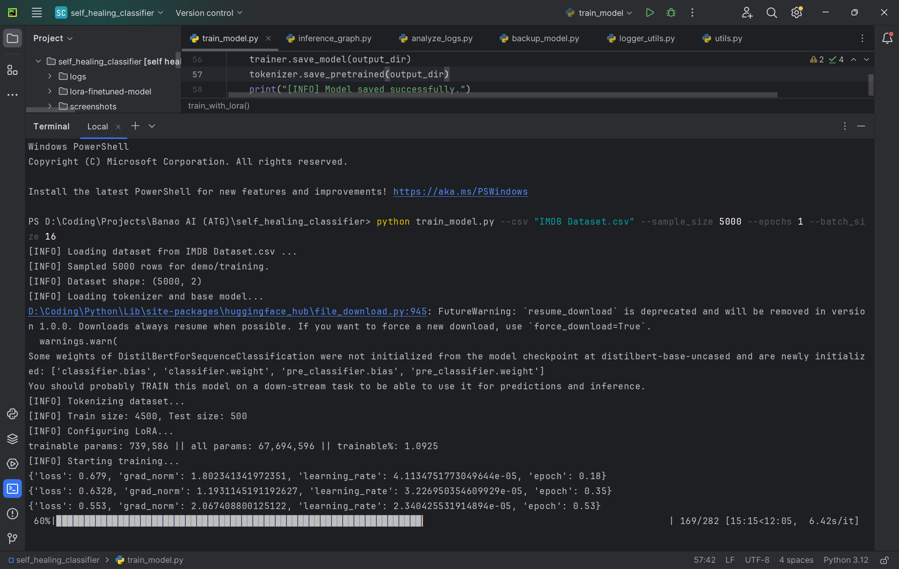
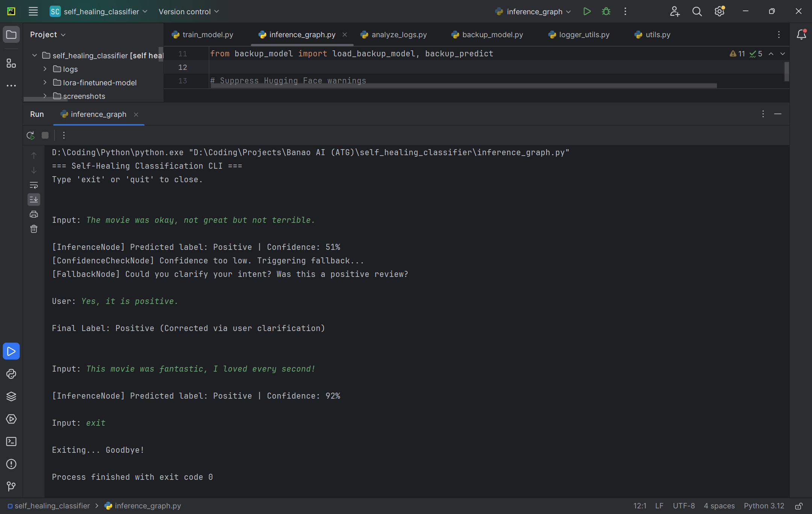
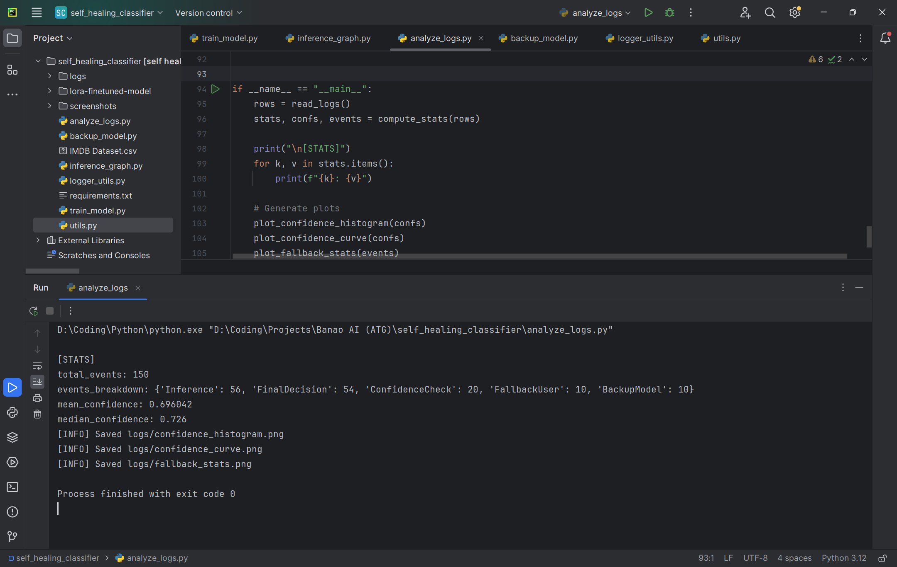
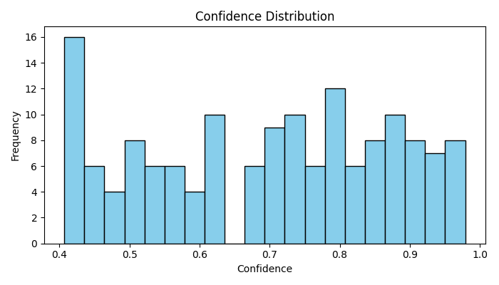
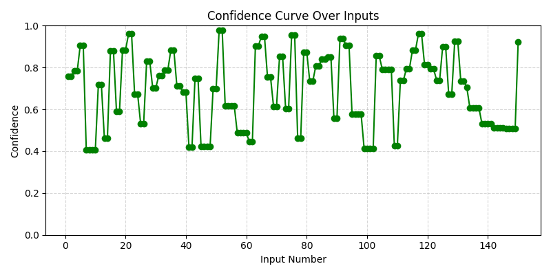
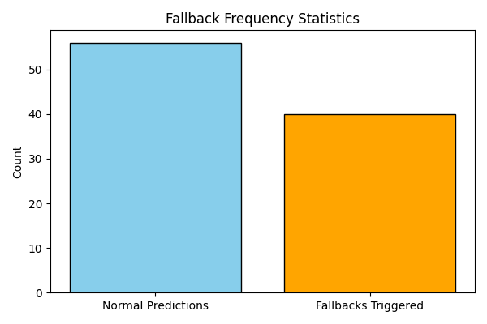

# 🛠️ Self-Healing Text Classification System  

This project implements a **self-healing text classification pipeline** using **LangGraph** and a **fine-tuned DistilBERT model with LoRA**.  
The system detects **low-confidence predictions** and automatically triggers a **fallback strategy** – either by asking the user for clarification or by using a **backup zero-shot model** – ensuring more reliable and human-aware classification.  

---

## 🎥 Demo Video
[Demo video of the project](https://your-demo-link.com)  

---

## 🚀 Features
- **Fine-tuned DistilBERT with LoRA** on IMDB sentiment dataset.  
- **LangGraph DAG workflow** with:  
  - `InferenceNode` → Classification step.  
  - `ConfidenceCheckNode` → Threshold-based confidence validation.  
  - `FallbackNode` → User clarification or backup model inference.  
- **Self-healing mechanism** for robust predictions.  
- **Interactive CLI** for classification and user-in-the-loop corrections.  
- **Structured logging** with all predictions, fallbacks, and final decisions.  
- **Analytics module** to generate confidence/fallback visualizations.  

---

## 🧩 Workflow

- **InferenceNode** → Classifies input text.  
- **ConfidenceCheckNode** → If confidence < threshold → trigger fallback.  
- **FallbackNode** → Uses backup zero-shot model or asks the user.  
- **FinalDecision** → Logs the final classification.  

Example flow:

```text
Input: The movie was painfully slow and boring.

[InferenceNode] Predicted label: Positive | Confidence: 54%
[ConfidenceCheckNode] Confidence too low. Triggering fallback...
[FallbackNode] Could you clarify your intent? Was this a negative review?
User: Yes, it was definitely negative.

Final Label: Negative (Corrected via user clarification)
```

---

## 📂 Project Structure

```
self_healing_classifier/
│── train_model.py        # Fine-tunes DistilBERT with LoRA
│── inference_graph.py    # LangGraph DAG for classification + fallback
│── analyze_logs.py       # Log analysis and graph generation
│── backup_model.py       # Backup zero-shot classifier (BART-MNLI)
│── logger_utils.py       # Structured logging utilities
│── utils.py              # Dataset loading & preprocessing
│── logs/                 # Generated classification logs
│── screenshots/          # Screenshots (training, CLI run, analysis, graphs)
│── requirements.txt      # Project dependencies
│── README.md             # Documentation
│── IMDB Dataset.csv      # IMDB Sentiment Dataset
```

---

## 🛠️ Installation

Clone the repo and install dependencies:

```bash
git clone https://github.com/yourusername/self_healing_classifier.git
cd self_healing_classifier
pip install -r requirements.txt
```

---

## ▶️ Usage

### 1. Fine-Tune the Model  
Run training on a subset of IMDB dataset (5,000 samples, 1 epoch, batch size 16):  

```bash
python train_model.py --csv "IMDB Dataset.csv" --sample_size 5000 --epochs 1 --batch_size 16
```
- Here, --sample_size 5000 is used for testing/demo purposes only (to make training faster).
- For full training, remove --sample_size argument and run on the complete dataset.
- This will create the LoRA fine-tuned model in `./lora-finetuned-model`.

---

### 2. Run CLI Classifier  

#### Without Backup Model (user clarification only if confidence is low):  
```bash
python inference_graph.py --model_path ./lora-finetuned-model --threshold 0.7
```

#### With Backup Model (zero-shot classifier used if confidence is low):  
```bash
python inference_graph.py --model_path ./lora-finetuned-model --threshold 0.7 --use_backup
```

---

### 3. Analyze Logs & Generate Graphs  
```bash
python analyze_logs.py
```

This generates:  
- `confidence_histogram.png`  
- `confidence_curve.png`  
- `fallback_stats.png`  

---

## ⚖️ Example Run

```text
Input: Mediocre at best, but had a few funny scenes.

[InferenceNode] Predicted label: Negative | Confidence: 41%
[ConfidenceCheckNode] Confidence too low. Triggering fallback...
[FallbackNode] Could you clarify your intent? Was this a negative review?
User: No, I found it positive overall.

Final Label: Positive (Corrected via user clarification)
```

---

## 📸 Screenshots

### 1. Training Process  


### 2. Running CLI Inference  


### 3. Running Log Analysis  


---

## 📊 Generated Graphs

### Confidence Histogram  


### Confidence Curve  


### Fallback Statistics  


---

## 📝 Logging

All events are stored in:  

```
logs/classification.log
```

Each row contains:  
- **Timestamp**  
- **Event** (Inference, ConfidenceCheck, FallbackUser, BackupModel, FinalDecision)  
- **Text** (input sentence)  
- **Prediction**  
- **Confidence**  
- **Note** (clarification, backup decision, pipeline end)  

### Example Log Snippet
```
2025-10-02 08:45:35,Inference,The dialogues were cringe-worthy.,positive,0.7572,
2025-10-02 08:45:35,FinalDecision,The dialogues were cringe-worthy.,positive,0.7572,end of pipeline
2025-10-02 08:45:35,Inference,"Mediocre at best, but had a few funny scenes.",negative,0.4068,
2025-10-02 08:45:35,ConfidenceCheck,"Mediocre at best, but had a few funny scenes.",negative,0.4068,LOW
2025-10-02 08:45:35,FallbackUser,"Mediocre at best, but had a few funny scenes.",positive,0.4068,User clarified
2025-10-02 08:45:35,FinalDecision,"Mediocre at best, but had a few funny scenes.",positive,0.4068,end of pipeline
```

---

## ⭐ Highlights

- LoRA fine-tuned DistilBERT for sentiment classification.  
- DAG-based workflow with fallback handling.  
- User-in-the-loop + backup model for robustness.  
- Confidence and fallback visualizations for better interpretability.  
